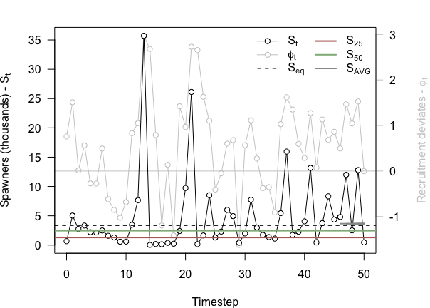

Constructing confidence intervals on Historical Spawners benchmarks
================
Stephanie Peacock
2020-01-15

This project aims to compare different methods to constructing 95% confidence intervals on Historical Spawners (HS) benchmarks for inclusion in the [Pacific Salmon Explorer](www.salmonexplorer.ca).

Background
----------

To date, the assessments of biological status in the Salmon Explorer have provided confidence intervals for the Stock-Recruitment (SR) benchmarks, but not for the HS benchmarks. The HS benchmarks are calculated as the 25th and 50th percentiles of historical spawner abundance for the CU. (Note that older assessments under the Pacific Salmon Explorer considered the upper HS benchmark to be the 75th percentile of historical spawner abundance.)

In their study of data-limited Chum-salmon Conservation Units (CUs) in Southern BC, [Holt et al. (2018)](http://www.dfo-mpo.gc.ca/csas-sccs/Publications/ResDocs-DocRech/2018/2018_011-eng.html) constructed confidence intervals on HS benchmarks using naive bootstrapping "by resampling the time-series with replacement to generate a distribution of lower and upper benchmarks". However, they recognized that this approach may may over-estimate confidence intervals if time-series are autocorrelated, which is likely the case for time-series of spawner abundances. They recommended that methods that account for temporal autocorrelation should be considered in the future.

Methods
-------

We consider two alternative approaches to generating confidence intervals on the HS benchmarks that account for autocorrelation in the time-series of spawner abundances. The first is known as "block bootstrapping" and the second is a model-based approach. We compare these two approaches along with the naive bootstapping applied by [Holt et al. (2018)](http://www.dfo-mpo.gc.ca/csas-sccs/Publications/ResDocs-DocRech/2018/2018_011-eng.html).

To quantify the difference between approaches with increasing temporal autocorrelation in spawner abundance, we tested the methods on simulated data. We simulated a time-series of spawner abudnances using the Ricker equation, including temporal autocorrelation in residuals. The parameters for the simulated data were:

``` r
a <- 1.4                            # productivity
b <- 0.0003                     # density dependence
sigma <- sqrt(1.3)      # variance in recruitment deviates
tau <- 0.6                      # temporal autocorrelation in recruitment deviates
n <- 50                             # number of years of data to simulate 
```

We also simulated harvest to have a realistic time-series. We assumed a constant target harvest rate with beta-distributed error around the realized harvest rate each year:

``` r
targetHarvest <- 0.42                           # target harvest rate
sigmaHarvest <- 0.13                            # standard deviation in realized harvest rate

beta1 <- (targetHarvest^2 - targetHarvest^3 - sigmaHarvest^2*targetHarvest)/(sigmaHarvest^2)
beta2 <- (targetHarvest * (1 - targetHarvest)^2 - sigmaHarvest^2*(1 - targetHarvest))/(sigmaHarvest^2)

set.seed(38764)
harvestRate <- rbeta(n = n, shape1 = beta1, shape2 = beta2)
```

We initialized the simualted time-series using a spawner abundance that was 20% of the equilibrium spawner abundance, and then simulated the dynamics of recruitment and harvest over the next 50 years:

``` r
spawners <- numeric(n + 1)          # vector to store spawner abundance
spawners[1] <- 0.2 * (1/b)          # initiate spawner abundance at 20% Seq
phi <- numeric(n + 1)                       # vector to store recruitment deviates
phi[1] <- rnorm(1, 0, sigma)        # initiate recruitment deviates assuming phi[0] = 0
recruits <- numeric(n + 1)          # vector to store recruits
    
set.seed(91830)
for(i in 1:n){
    phi[i + 1] <- tau * phi[i] + rnorm(1, 0, sigma) 
    recruits[i + 1] <-spawners[i] * exp(a - b * spawners[i]) * exp(phi[i + 1])
    spawners[i + 1] <- (1 - harvestRate[i]) * recruits[i + 1]
    }
```

The HS benchmarks for the simulated time-series are:

``` r
HS_bench <- quantile(spawners[2:(n + 1)], c(0.25, 0.5))
AvgS <- prod(tail(spawners, 4))^(1/4)

HS_bench
```

    ##      25%      50% 
    ## 1297.232 2450.026



### Naive bootstrapping

Naive bootstrapping does not account for the autocorrelation in the timeseries. The spawner abundances are simply sampled with replacement, and the HS benchmarks calculated from the re-sampled data. This is repeated many (thousands) times and then the 2.5% and 97.5% quantiles of the bootstrapped benchmarks give the 95% confidence interval.

``` r
nBoot <- 1000
HS_benchBoot <- matrix(NA, nrow = nBoot, ncol = 2, dimnames = list(c(1:nBoot), c("S25", "S50")))

for(i in 1:nBoot){
    spawners.i <- sample(spawners[2:(n + 1)], replace = TRUE)
    HS_benchBoot[i, ] <- quantile(spawners.i, c(0.25, 0.5))
}

HS_benchCI_naive <- apply(HS_benchBoot, 2, quantile, c(0.025, 0.975))

HS_benchCI_naive
```

    ##             S25      S50
    ## 2.5%   452.7193 1859.878
    ## 97.5% 1842.0126 3752.697

### Block boostrapping

TBD.

### Model-based approach

In the model-based approach, we first fit a model to the time-series of spawner abundances to estimate the autocorrelation.

*Find the residuals from the fitted series. Then generate new series using an initial value, generate a new value for next year based on the autocorrelation and bootstrapping from the RESIDUALS of the fit. This will generate bootstrapped series that incorporate autocorrelation. The non-stationarity could also be modelled in the same way and you would generate new values based on a parametric bootstrap from the estimated trend and its uncertainty.*
